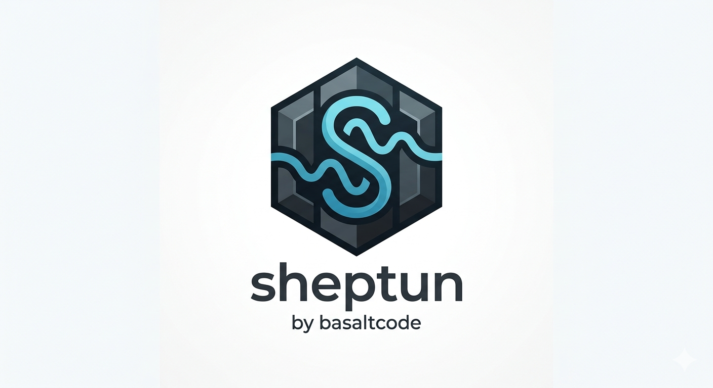

<p align="center">
  
</p>

# Sheptun

Open source приложение для локальной и бесплатной транскрибации аудио и видео с использованием Whisper от OpenAI. Всё работает на вашем компьютере — данные никуда не отправляются.

Превращает речь в текст — из локальных файлов, видео с YouTube или голосовых сообщений Telegram.

Название Sheptun — от Whisper (англ. «шёпот»). Sheptun — тот, кто шепчет шёпотом (Whisper).

От студии [Basalt Code](https://basalt-code.ru).

## Возможности

- **Аудио файлы** — транскрибация файлов OGG, MP3, WAV, M4A с компьютера
- **Видео файлы** — создание субтитров (SRT, VTT) из видео MP4, AVI, MOV, MKV, WEBM
- **YouTube** — вставьте ссылку, аудио скачивается и транскрибируется автоматически
- **Telegram** — распознавание голосовых сообщений из экспорта Telegram Desktop
- **Прогресс в реальном времени** — отображение процента, времени и логов Whisper
- **Переименование результата** — можно изменить имя выходного файла прямо в приложении
- **Выбор модели Whisper** — от tiny (быстрая) до large (максимальная точность)
- **Выбор языка** — русский, английский, украинский или автоопределение
- **Форматы вывода** — TXT, SRT, VTT, JSON, TSV
- **Перевод** — режим speech-to-English через Whisper translate

Результаты сохраняются в папку `~/Downloads`.

Поддерживаемые платформы: **macOS**, **Windows**, **Linux**.

## Требования

Никаких! Все зависимости (Python, Whisper, ffmpeg, yt-dlp) устанавливаются автоматически при первом запуске. Просто скачайте и запустите.

> **Первый запуск** займёт несколько минут — приложение скачает и настроит необходимые компоненты.

## Скачать

Скачайте последнюю версию для вашей платформы на странице [Releases](https://github.com/basaltcode/sheptun/releases/latest).

## Установка

### macOS

1. Скачайте `.dmg` файл по ссылке выше
2. Откройте его и перетащите приложение в папку `Applications`
3. При первом запуске: правый клик → "Открыть" (приложение не подписано)
4. При первом запуске приложение автоматически создаст Python-окружение и установит зависимости

### Windows

1. Скачайте `.exe` файл по ссылке выше
2. Следуйте шагам установщика
3. При первом запуске приложение автоматически установит Python-зависимости

### Linux

1. Скачайте `.AppImage` файл по ссылке выше
2. `chmod +x Sheptun-1.1.0.AppImage && ./Sheptun-1.1.0.AppImage`

## Использование

1. Запустите приложение
2. Выберите вкладку: **Аудио**, **Видео**, **YouTube** или **Telegram**
3. Загрузите файлы, вставьте ссылку YouTube или выберите папку Telegram
4. Настройте параметры Whisper:
   - **Модель**: tiny, base, small, medium, large (чем больше — тем точнее, но медленнее)
   - **Язык**: русский, английский, украинский или авто
   - **Формат**: txt, srt, vtt, json, tsv
5. Нажмите "Транскрибировать"
6. Результат сохранится в папку `~/Downloads`

### YouTube

`yt-dlp` устанавливается автоматически. При первом использовании macOS попросит доступ к кукам Chrome (Keychain) — это нужно, чтобы YouTube не блокировал загрузку.

## Сборка из исходников

### Разработка

Для сборки из исходников потребуется:
- **Python 3.8+** — для запуска бэкенда
- **Node.js 20+** — для сборки фронтенда и Electron

```bash
# Установить зависимости
npm install
cd frontend && npm install && cd ..

# Запуск в режиме разработки
npm run dev
```

### Сборка установщиков

```bash
# macOS (.dmg)
npm run build:mac

# Windows (.exe) — требуется Windows или CI
npm run build:win

# Linux (.AppImage)
npm run build:linux
```

Собранные файлы появятся в папке `release/`.

## Старый способ запуска (без Electron)

Можно запускать как веб-приложение через браузер:

```bash
./start.sh
```

Откройте `http://localhost:5173` в браузере.
